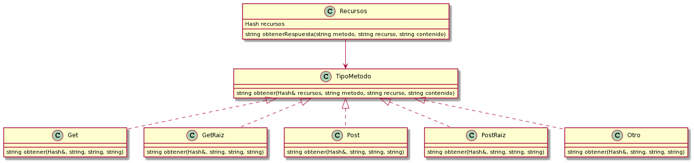
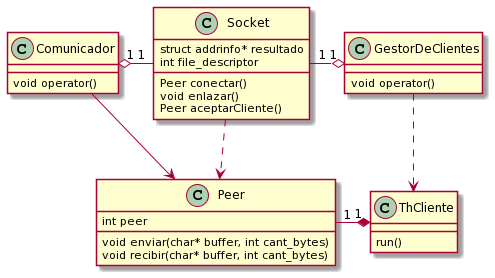

# TP3

Nombre completo: Sebastian Bento Inneo Veiga

Padron: 100998

Link: https://github.com/SBen-IV/tp3

# Descripción

El trabajo práctico presentado corresponde a un programa dividido en cliente y servidor. El cliente realiza peticiones HTTP al servidor el cual responde con lo pedido. En este TP el servidor tiene la particularidad que puede atender a más de un cliente a la vez y cerrarse en cualquier momento durante su ejecución.

Uno de los desafíos de este TP consistía en utilizar polimorfismo con alguna clase. Dado que dependiendo de la petición se tenía que devolver una respuesta distinta se decidió hacer que cada tipo de petición sea una clase. De esta forma, como se ve en el diagrama, se hicieron 5 clases, cada una responde a la petición de una manera particular sin necesidad de estar preguntando el tipo de recurso que se pide (por esto hay 2 clases especializadas con "Raiz").

Los TipoMetodo son instanciados dentro de `obtenerRespuesta` para luego llamar a `obtener` que devuelve la respuesta que finalmente se enviará a través del servidor hacia el cliente para imprimirla por pantalla.

La siguiente problemática fue el uso del Socket. En un principio se utilizó una única clase pero más adelante se decidió separarla en 2: un Socket que sólo escucha y un Peer que es el que se encarga de enviar y recibir mensajes.

De esta forma se pudieron solucionar las 2 problemáticas más importantes del TP siguiendo la estructura de la programación orientada a objetos.